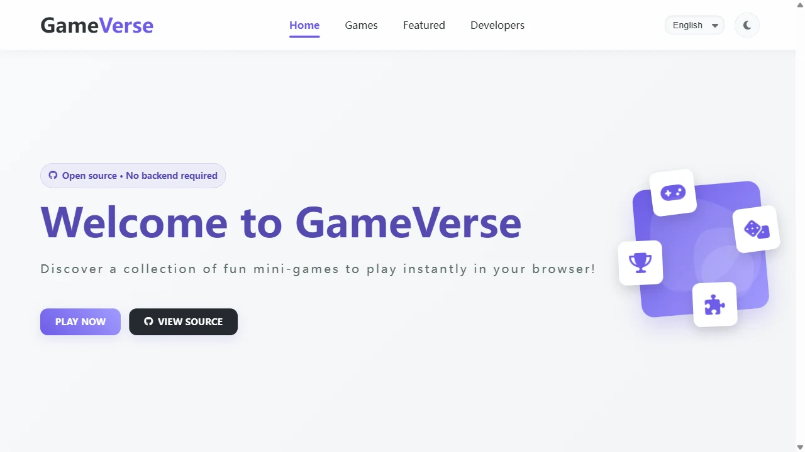

# GameVerse — Open Source Browser Mini Games

[](https://dengkai666666.github.io/gameverse-mini-hub/)
[](https://github.com/dengkai666666/gameverse-mini-hub/stargazers)
[](LICENSE)

<p align="center">
  <a href="https://dengkai666666.github.io/gameverse-mini-hub/"><strong>Live Demo</strong></a>
  ·
  <a href="CONTRIBUTING.md"><strong>Contributing</strong></a>
  ·
  <a href="LICENSE"><strong>MIT License</strong></a>
</p>



GameVerse is a polished, bilingual mini-game collection that runs entirely in the browser. It has no backend, no build step, no database and no paid service dependency—just static HTML, CSS and JavaScript that can be deployed on any free frontend host.

> 中文简介：GameVerse 是一个完全静态、无需后端的双语小游戏合集，针对手机触控、深浅主题、键盘操作和无障碍体验进行了优化。

## Play now

**https://dengkai666666.github.io/gameverse-mini-hub/**

## Games

| Game | Highlights | Controls |
| --- | --- | --- |
| Memory Match | Timer, move counter, accessible cards | Tap / click / keyboard |
| Snake | Difficulty, obstacles, walls, portals, high score | Arrow keys / touch pad |
| Tic Tac Toe | Two-player and computer modes | Tap / click / keyboard |
| 2048 | Animated moves, undo, hints, best score | Swipe / arrows / WASD |
| Flappy Bird | Responsive canvas and saved best score | Tap / click / Space |
| Solitaire | Drag, click-to-move, undo, hints, auto move, tutorial | Touch / mouse / keyboard shortcuts |

## Why GameVerse

- **Frontend only** — deploy the repository directly to GitHub Pages.
- **Mobile first** — responsive layouts, large touch targets and swipe controls.
- **Bilingual** — instant Chinese/English switching with saved preference.
- **Accessible** — semantic controls, keyboard navigation, live status text and reduced-motion support.
- **Theme aware** — polished light and dark themes with persistent settings.
- **Local player record** — personal bests and completed rounds stay privately on the device.
- **Easy to share** — native mobile sharing with a clipboard fallback helps friends open the live demo.
- **Zero install** — no package manager, framework or build pipeline required.
- **Works offline** — the service worker precaches the complete game collection after the first visit.

## Run locally

```bash
python -m http.server 8000
```

Open `http://localhost:8000/`. You can also open `index.html` directly, although a local static server gives the most consistent browser behavior.

## Architecture

```text
index.html / styles.css / script.js     Homepage, themes, filtering and i18n
game-page.css                           Shared standalone-game layout
translations.js                         Chinese and English strings
memory-game.js                          Memory Match
snake.html / snake.js                   Snake
tic-tac-toe.html / tic-tac-toe.js       Tic Tac Toe
2048.html / 2048.css / 2048-anim.js     2048
flappy-bird.html / flappy-bird.js        Flappy Bird
solitaire.html / solitaire.css / solitaire.js
site.webmanifest / favicon.svg / sw.js   Installable app metadata and offline cache
```

## Quality targets

- Works without a backend server.
- Works offline after the first successful visit.
- No horizontal overflow at 390px mobile width.
- Keyboard-accessible interactive controls.
- Light and dark theme contrast checks.
- JavaScript syntax validation with `node --check`.
- Lighthouse accessibility, best-practices and SEO audits.

## Contributing

Issues and pull requests are welcome. Please read [CONTRIBUTING.md](CONTRIBUTING.md) before adding a game or changing shared UI.

If you enjoy GameVerse, please **star the repository** and share the live demo.

## License

[MIT](LICENSE) © 2026 GameVerse contributors

Font Awesome Free assets are bundled for reliable offline loading under their original open-source licenses; see [`vendor/fontawesome/LICENSE.txt`](vendor/fontawesome/LICENSE.txt).
